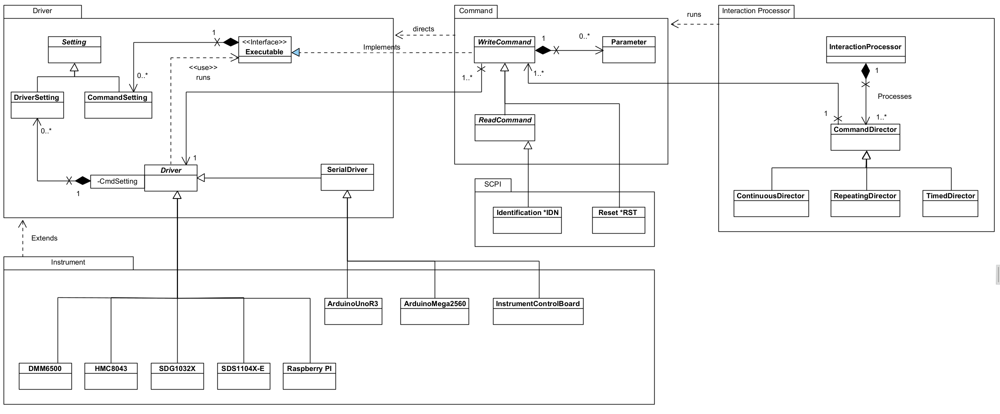
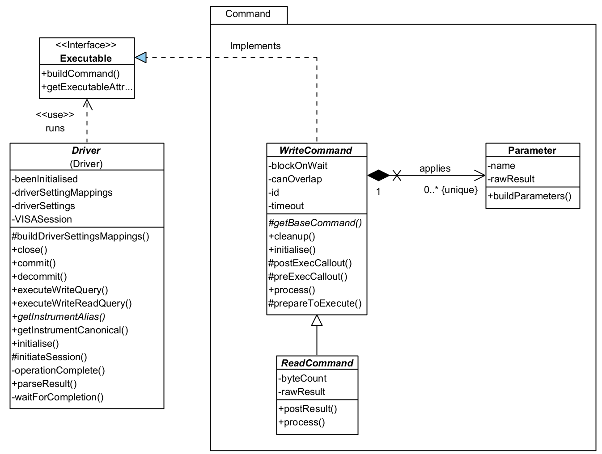
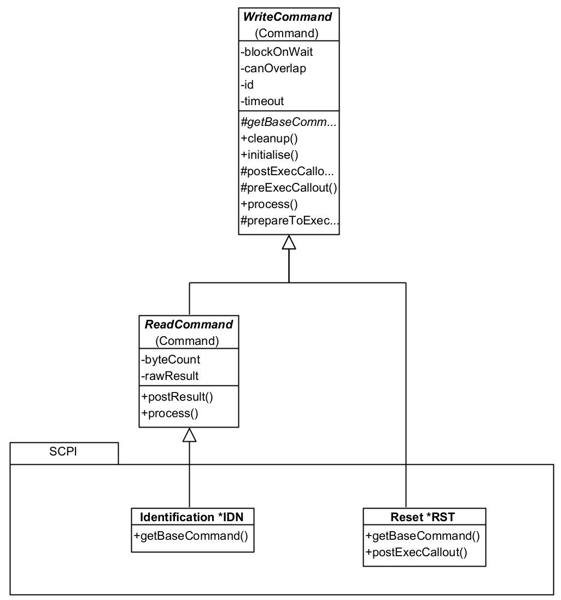
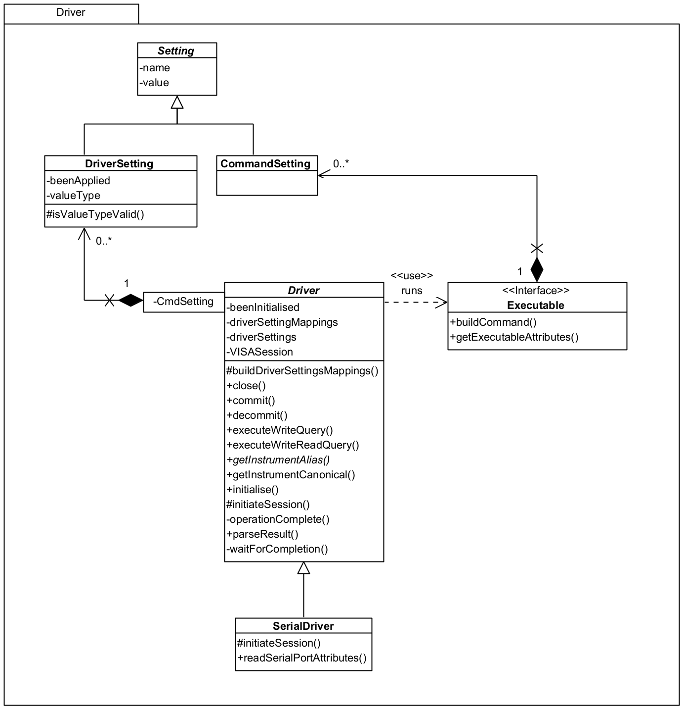
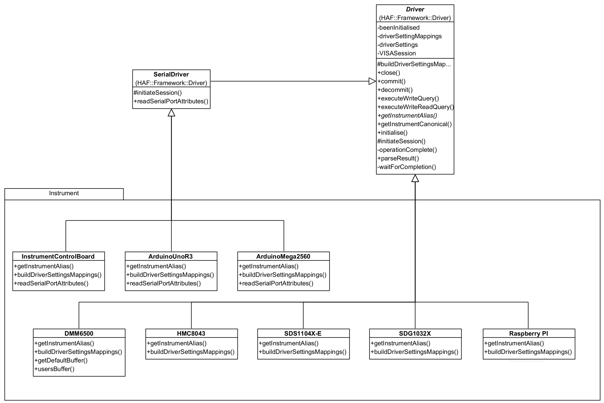
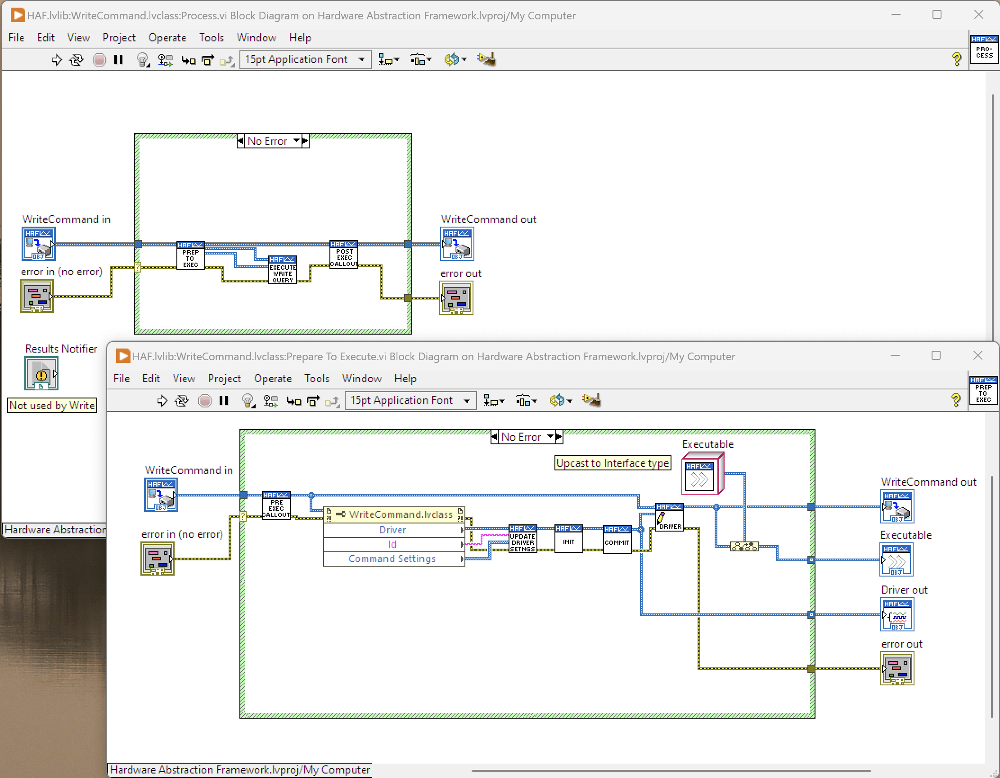
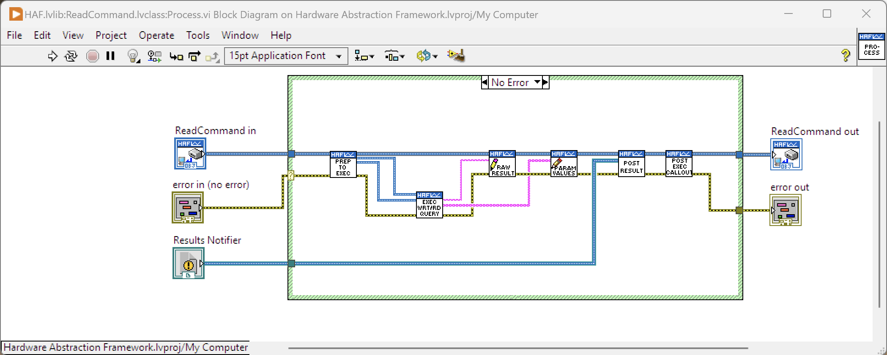

# Hardware Abstraction Framework
This framework provides a means of driving physical instruments through the use of abstract commands (non-instrument specific) in an automated way.

Currently, the framework is very SCPI focussed but can be extended to support other command syntaxes. In the current version available commands are limited but the fundamental framework is in place.

## Dependencies
There are no dependencies for the framework.  It is designed to be cloned into the \LabVIEW Data\ProjectTemplates directory to be used as a template for a new project.  That directory should exist before cloning.

## Installation
Clone the repository to \LabVIEW Data\ProjectTemplates and you are good to go.  To use it, create a new project and select the HAF template.  

## Overview
The basic approach to instrument interaction is to send one or more commands to one or more instruments and process the results.  Some interactions will be simple, one-off commands; others will be more complex involving multiple commands, over multiple instruments, over an extended period of time.

The framework attempts to meet these needs and has some basic concepts which a user should be aware of:
* **Interacting Application (also just application):** this is not a framework class or construct; instead it is a term used for the application that uses the framework to interact with instruments.  It is the application you will write.
* **Commands:** a command is an instruction sent to an instrument that it can understand, run and, if necessary, provide a result.  The framework seperates out *instrument specific* commands from *instrument independent* commands which means that you can build interactions up without a specific understanding of instrument-specific syntax, e.g. you could use a command such as `identity` rather than `*IDN?`.  The framework calls these `Commands` and there are two types: a `WriteCommand` - sends a command only - and `ReadCommand` - sends a command then reads a result.
* **Instrument:** a representation of an acutal physical device to be used.  This can be anything that can be driven by LabVIEW and the framework doesn't require instrument-specific drivers.  Instruments are abstracted so that you can use them 'generically' leaving the framework to do any necessary translation into 'specifics'.  Obviously, to use your own instruments you will need to provide some of this translation but the benefit will be that your overarching interactions can be generic and reusable across different instruments, e.g. substitution of one manufacturer's DMM with another manufacturer's DMM without change, or minimal change, to the running application.  The framework calls these instrument abstractions `Drivers`.  Drivers provide the interface between the framework and an instrument.  
* **Interaction Processor and Directors:** these actually control the running of Commands against a Driver in a controlled manner.  Essentially, they control the overall execution flow and can utilise pre-defined events and messages to callback to the Interacting Application itself.  Complex processing can be controlled by using specific types of Directors: `CommandDirector` (single-shot), `RepeatingDirector` (numbered iterations), `ContinuousDirector` (infinite iterations until stopped), and `TimedDirector` (timed duration).  The `InteractionProcessor` is the master controller and interacting launch point.

The basic approach to running an interaction is to follow these steps:
1. Instantiate a `Command` that represents the command you wish to use.
2. Associate an `Instrument` - a concrete instance of a `Driver` to that Command which will represent the instrument to send the Command to.
3. Repeat this for each command you want to run in your interaction.
4. Associate these Commands to one or more `CommandDirector` instances, selected on the basis of how you wish the commands to run.  For example, you may select a `CommandDirector` to run once an `Identity` Command and a `RepeatingDirector` to run a `Measure` Command 10 times.
5. Associate these CommandDirectors to an `InteractionProcessor` and run the interaction.  The Processor will process each CommandDirector until they have finished; results are sent back to the Interacting Application as either a Results Message or a Results Notifications (your choice) and the Processor will listen for events such as `Pause`, `Resume`, `Stop` and modify the processing accordingly.
6. Your application can listen out for a `Done` event to know when processing has finished; it can also look for `result` messages or `result notifier` notifications to handle and display those.  How complex you make these is up to you but check out the examples for ideas.

Many Commands in the framework can be used as-is in applications but there may be Commands that are missing for your purpose.  You can create your own by following the pattern established for the existing ones.

Similarly, the CommandDirectors are likely to be sufficient for most applications but again, you can create your own by following the pattern established for the existing ones.

Unless you use the same instruments that are wrapped by Drivers in the framework, it is most likely that you will have to create your own for your instruments.  Once again you can follow the pattern established for the existing ones; you may want to consider uploading these to the repository for inclusion in a future release.

The rest of this document describes the framework in more detail and how you can use it.
### Interacting with the Framework
Your application will engage with the framework through other means than just asking it to process Commands.  The Framework is set up to respond to `Events` your application can raise:
* **Pause:** Processing will be paused at the end of the current processing of CommandDirector(s) - remember these could be long-running.  It does need to finish any currently running processing so as to ensure instruments are not left in an unknown state.  The Pause will timeout after 60-seconds and all processing will finish with an error being returned indicating the timeout occurred.
* **Resume:** Processing will be resumed if paused.
* **Stop:** Processing will stop immediately after the current processing of CommandDirector(s) - again, so that instruments are not left in an unknown state.
* **Inject:** CommandDirectors (with Commands) can be injected into a running Interaction for execution.  They will be added at the end of the current set of CommandDirectors that the InteractionProcessor is processing.  the InteractionProcessor needs to be primed to Handle Injections when it is launched otherwise it may finish before CommandDirectors can be injected.

***
There is no concept of *Abort Immediately* - the framework will always attempt to properly close an instrument down so that it is not left in an unknown state.
***

The Framework will interact with your application through `Events` as well:
* **Done:** Raised by the Framework when all processing has completed. You could, perhaps, on hearing this event, unblock the UI, display any messages, quit the application, write results to a database and so on.

It also engages with your application via messages on a Notification Queue or via a notifier:
* **Result:** When a `ReadCommand` runs and receives a result, it stores that and posts itself on to the Notification Queue as message data for the `Result` message.  Your application should be waiting to receive these messages so you can do something with the result.  The Command knows how to process a raw result (from the instrument) into something useable and of a specific data type; any results for parameters can also be processed into useable information.  Each Command has a unique ID and you can tie a result on the Notification queue to a specific Command instance so your application knows how to handle the result.  

* **Result Notifier:** Create a Notifier and pass it into the Framework.  Each result received will be posted through this notifier to the Interacting Application (as for Result, the data passed is the ReadCommand itself which stores the result.)  

Which to use?  The framework may block the Interaction Application when it is called, until all processing is finished.  Whilst the results will be posted as messages on the Notification queue, your application won't get a chance to process them until the Framework is `Done`.  This is fine for simple commands but no use for long-running commands.  In the latter case, you will want a parallel thread waiting on a Notifier to appear containing the result - these can be processed as they are generated by the Framework, irrespective of whether the rest of the application is blocked.

Events, Messages and Notification Queues are all established by the Framework and are available for your application to use.  You must create your own Notifier to pass into the Framework if you take this approach for result processing.

Examine the example applications to see how to use Events and Notifications.  These example applications form part of the Project Template and can be used as a base for building your own applications on.

## Framework Structure
The framework has been mostly written using LabVIEW's object oriented features so the majority of engagement between your application and the framework will involve the use of classes; extensions to the framework will likewise be done through extending existing classes and overriding methods.

As the source is provided, you are encouraged to use one of the examples and single-step through it observing how the framework is called and how interactions play back-and-forth.

In terms of processing, the framework follows a Queued Message Handler pattern which is standardised within LabVIEW.  The examples, although simple in themselves, also use this approach to provide a basic pattern for you to follow in your own applications.

***
**A note on LabVIEW's approach to object oriented programming**

NI decided that a by-value approach to objects will be used, rather than by-reference.  The implications of this is that all data flows work on *copies* of data rather than references.  You need to bear this in mind as it is easy to get caught out.  In many cases, changing some object's data member will be on that copy and not an originating instance - the data will need writing back to that instance.  This can be confusing when changes don't work!  The framework takes care of it correctly in its own processing, but any you add, or code within your application must be carefully written to avoid data loss or unexpected behaviour.
***
### Core Classes
Note: The diagrams below are intended to show main classes and methods and are not a complete picture of the framework.

The class diagram above shows the classes and relationships that form the core element of the framework.  It's broken down in the following sections.
#### Command

A Command represents a command that can be sent to an Driver for running on an instrument.  As the framework evolves over time, these will become much more than just commands for Drivers, and will represent other execution constructions such as optional pathways, or directives to help with processing.

There are two types of Command:
* **WriteCommand:** represents a command that can be sent to an instrument but which requires no response.
* **ReadCommand:** represents a command that can be sent to an instrument and for which a response or result will be returned.  You will note it inherits some of its functionality from `WriteCommand`: you don't need to run a WriteCommand *and* a ReadCommand as the latter incorporates the functionality for you.

A Command is associated with a `Driver` whose responsibility it is to undertake any instrument specific translation of a command.  The framework will arrange for the Driver to run the command at the appropriate moment.

There are two ways a `Driver` can run a Command:
* Immediately: as it says - the Driver sends the command straight to the instrument.
* When able: in this case, the Driver will wait for the instrument to finish processing any existing commands before sending this one.

A Command controls this with its `canOverlap` property: if true, the Command will be run immediately; if false, when able.

A `ReadCommand` will hold a result returned from the instrument.  It does so in a raw form, `rawResult` - that is, it provides no interpretation of that result until asked to do so by the application calling `buildResult`.  The application will be notified of an available result via a `result` message raised on the `Notification` queue or a raised `Notifier`.  The result data is the same in both cases: the Command itself is passed back to the app and can be used to obtain the results as a raw value (String) or a typed value.

Some Commands can take parameters to send along with the base command.  These are represented by the `Parameter` class.  The framework will automatically add any requested parameters to the command before it is sent to the instrument: you just need to add the ones you want to the Command when you create an instance of it.  A Parameter will hold a result, if available, and is capable of parsing that into a typed value for the application.

`CommandSettings` are a way of provisioning configuration settings for Drivers, independently of how they may be applied to an instrument.  For example, you might use a CommandSetting called 'Settling Time'; on one DMM it might equate to 'Settle Time' whilst on another it might be 'Settling Duration'.  You won't care - the driver will map these to instrument specific configurations.

You'll see from the class diagram that CommandSettings provides no specific behaviour so is really just a placeholder for now.  There is more information in the [Settings](#settings) section below, but the functionality for settings hasn't needed any specific behaviour for Commands in the current version.

So what do you need to do to use the framework?  Basically, just use one of the existing Commands and add it to a CommandDirector.  If none of the existing Commands are of any use, then create your own by following the pattern established by an existing one.

Here's an overview of four Commands:

You can see that all is needed is a concrete implementation of `getBaseCommand` (the command as it appears without any parameters or end of line characters.) The Reset Command has also provided a postExecCallout method which is called after the command processing is finished (write and reply) so that additional processing can be done - this is a callout and is only implemented when needed.  ReadCommand classes can also add additional methods such as resultAsDouble or resultAsTimestamp etc. which parses a raw result into a useable format for the application.  That isn't strictly necessary as the Framework also provides helper VIs for that.

The UserDefinedRead and UserDefinedWrite are generic Commands that can be loaded with any command string you wish and can be used instead of creating specific Command classes.

These commands aren't strictly part of the Framework because they would normally form part of an Interacting Application. They are provided with the Framework as they are (a) re-usable; and (b) form a good example to build upon.

#### Driver

`Driver` is responsible for interfacing with actual instruments providing the necessary mappings between a generic language and instrument-specific language.  By doing this, a user of the framework can standardise on names for things like commands, parameter names, setting names and so on and leave the Driver to translate on an instrument-by-instrument basis.

`SerialDriver` should be used for instruments that will use a Serial communication method, e.g. Arduino Uno.  This operates the same way as the standard Driver but expects a device to be available on a mapped `COM` port rather than on, say, a `USB` port.

It is envisaged that future versions of the framework will be able to load mappings between the generic and specific from an external source to allow applications to be more configurable.

A Driver will execute a query for an `Executable` when directed by the framework, obtaining a response as necessary. `Executable` is an interface to be implemented by a class that can provide a command to run on an Instrument - implemented by `WriteCommand` in the framework.  It provides a "seperation of concerns" between Commands and Drivers and prevents a cyclic dependency between the two parts of the Framework.

`DriverSetting` are configurable items for an instrument and are mapped between a generic `CommandSetting` and the instrument setting.  More information is available in the [Settings](#settings) section.

So what do you need to do?  When you instantiate a Command you need to give it a Driver, as implemented by an `Instrument` as a concrete subclass to be used to process it.  These can be selected by name and the framework will use that to identify a specific Driver for you - it only requires that the Driver implements getInstrumentAlias to return the known alias name that the instrument identifies with in NI-Max.  It's likely you will need to create your own Driver instances but examples are available to draw from:

You can see here that all you need to provide is a concrete implementation for `buildDriverSettingsMappings` and `getInstrumentAlias`, and readSerialPortAttributes if the device needs to override the framework values.  The framework handles everything else.

The Arduino Drivers (and Instrument Control Board which uses an Arduino) provides an overridden `readSerialPortAttributes` because I want to communicate with it at 115200 baud, rather than the default 9600 baud, and it needs the initialisation to wait 2000milliseconds after opening a port to ensure the Arduino will be available to process commands.

These concrete Drivers are available in namespace `Implementation`.  Strictly, this isn't part of the Framework as it not abstract, but part of the implementation of an Interacting Application.  However, it is provided along with the Framework because they are (a) re-usable; and (b) a good example to build upon.

#### Setting

`Setting` is meant to represent a specific configuration setting that can be sent to the instrument by the Driver - you can see it has a `name` and `value`.

There are two types of Setting:
* **DriverSetting:** This represents setting *as known to the instrument*.  The `type` is so that the framework can properly parse the value; `beenApplied` is set by the framework once the setting has been made so that it doesn't constantly send it on every command (see the section on process flow) - this could be reset so it is re-applied.  In fact, if you use a `Reset` Command, it ensures that the settings will be re-applied.
* **CommandSetting:** This represents a generic, non-instrument specific setting, i.e. a setting you can refer to for all instruments.  The Driver maps this setting to a `DriverSetting` which then removes any concern of naming differences.  E.g. you could refer to a setting `Settle Time` and on one DMM it might actually be `Settling Time` and on another DMM it might be `Time to Settle`.

You add CommandSetting to the Command (as implemented by WriteCommand) as you instantiate it.  If you create a Driver, you must also create a set of mappings from `CommandSetting` to `DriverSetting`; if a setting is not used by a particular driver, use `Ignore` as the mapped name and that's what the framework will do.

***
**Note:** The framework is currently very SCPI focussed and settings aren't actually used yet.  As the framework evolves it is envisaged they will become more integrated and the feature finished.

Therefore, currently, you should not use Settings as they are not fully implemented.
***

#### Processing

Processing of `Commands` is performed through `CommandDirector` instances and an `InteractionProcessor` instance.

* **CommandDirector:** The Director controls the processing of one or more Commands. Each Command is processed at least once and depending upon the choice of CommandDirector, multiple times.

    * CommandDirector: processes each Command once only.
    * RepeatingDirector: processes each Command `timesRepeat` times.
    * ContinuousDirector: processes each Command continuously until ordered to stop.  Your application can do this by raising a `stop` event.  You could abort the running VI but this may leave the instrument in an unknown state (recover with a `reset` Command in the next application run.)
    * TimedDirector: processes each Command for a *minimum* duration of time. 

        A CommandDirector can hold more than one Command and each Command is processed in turn in the order loaded.  A processing run for a CommandDirector is 'every Command', so `Stop` and `Pause` orders (via events) are acted on at the end of a run (actually, at the start of the next run if there is one.)  For the TimedDirector, the duration is a minimum amount of time because a processing run will be completed once started; note also that a `Pause` order does not stop the clock and the duration paused counts towards the overall duration.

        `waitTime` is a duration in milliseconds between processing of each Command.  So with a wait time of 10ms, and three Commands, processing will be Command1-wait 10ms-Command2-wait 10ms-Command3.  For a TimedDirector, this wait also counts towards the processing duration.

* **InteractionProcessor:** This is the framework's main control processor, responsible for processing all CommandDirectors.  You only need one instance of this and processing starts by calling member `runInteraction()`.  The InteractionProcessor listens for `Stop`, `Pause`, and `Resume` events, acting accordingly on the CommandDirectors.  Although not a member property, `processDirectors()` takes a `waitTime` as a parameter which acts the same way as `waitTime` on the CommandDirector, except the wait is between Directors not Commands.

    You select the CommandDirector(s) you want and add them to the InteractionProcessor.  Thus you can mix-and-match the interactions you want.  For example, you could load a `Reset` Command into a CommandDirector, followed by a `Measure` Command into a ContinousDirector.  This would then reset the instrument and continuously perform a measurement.

You should have no need to create an alternative InteractionProcessor but you may want a different CommandDirector.  Create this as a subclass of one of the existing Directors and implement `shouldContinue()` (return true if processing of Commands should occur again) and if necessary `initialise()` if the CommandDirector needs any setup (for example, the TimedDirector sets its `startMilliseconds` property in initialise so it can determine when the duration has elapsed.) 

Note that a `Pause` event will be acted upon but it will timeout after 60 seconds regardless of whether a `Resume` event is raised. This is to prevent Instruments just 'sitting there' and the pause event is not intended for long term interruption of Command processing.

### Processing Loop

The flow diagram above shows the high-level processing when `processDirectors()` is called on `InteractionProcessor` (via `runInteraction()`).  This is all under the control of the framework of course, you just need to instantiate the necessary CommandDirectors and Commands.  Note that CommandDirectors can finish independently of each other and are ignored in any subsequent run through.  For example, in the above image, if CommandDirector1 was a TimedDirector of 1 minute; CommandDirector2 was a ContinuousDirector; and CommandDirector3 was a single-shot Director (CommandDirectors instance) then:
* All will be processed in the first run through;
* In the second run through, CommandDirector3 will return `false` for `shouldContinue()` so won't run anymore
* In the third and subsequent run throughs up until 1 elapsed minute, CommandDirector2 and CommandDirector3 will run;
* In runs after 1 minute only CommandDirector3 will run, and will continue to do so until told to stop. 

So what happens when an Command is processed? 

*WriteCommand*

The flow diagram shows the process for running a WriteCommand along with the sub-process PrepareToExecute.
* **Pre-Exec Callout:** run any Command specific code before the Driver runs the command.
* **Update Driver Settings:** add any new CommandSettings to the Driver, which will map them to Driver Settings
* **Initialise:** tell the Driver to create a session to the Instrument if one doesn't already exist
* **Commit:** send any unprocessed Driver Settings to the Instrument
* **Execute Write Query:** send the command to the Instrument
* **Post Exec Callout:** run any Command specific code after the driver runs the command.

The `Pre-Exec Callout` and `Post-Exec Callout` can be implemented in your own Driver if something must be done before/after the query is sent.  For example, in Post-Exec Callout, the `Reset` Command, tells the Driver to reset all its Driver Settings so they will be reapplied before the next Command runs.

*ReadCommand*

The lead-in is the same as a WriteCommand, including Prepare To Execute but the additional steps are:
* **Execute Write Read Query:** sends the command to the Instrument and reads a result.  Results are issued for the Command and the Parameters as applicable.  See the Documentation tab on the member for details on how the result is parsed into constituent elements.
* **Write Raw Result:** saves the unformatted Instrument response for later processing
* **Write Param Values:** saves the unformatted Parameter responses for later processing
* **Post Result:** if a Results Notifier was passed with the Command, the Command adds itself to the Results Notifier and raises the Notification; otherwise, it adds a `result` message on the `Notification Queue` with the Command set as message data.  In either case, the Interaction Application should read this message and arrange for the result to be processed as required - not forgetting that results may be stored in the parameters if used.  Note that that a result sent as a Notification can be processes immediately, whereas the result on the Notification Queue will be held there until the InteractionProcessor has finished all CommandDirectors and is "Done".

## Examples
Example usage of the framework is provided so that you can use these as a basis of your own Interaction Applications but also get a better idea of how the framework actually works.  All examples are in virtual folder `Examples`.

They make use of the Drivers found in Virtual Folder `Implementation\Instrument`.  To run these with your own instruments you will need to create your own Drivers and make the necessary changes to the example implementations.  In some cases it may be as simple as ensuring that the VI `Get All Instruments` in class `ResourceEnumerator` is modified and that you have followed the implementation pattern for the existing instruments.

### 1-Instrument Identification
This example enumerates any instruments connected to the PC running LabView and presents the list to the user.  Selecting an instrument, by name, and pressing 'Get Id' will return the instrument identity.  

This is accomplished using the Driver associated to the selected name, the `Identity` Command and a `CommandDirector` (one-time execution.)  Results are provided as a Notification for handling and displaying on the UI.

### 2-Command Injection
This example shows how Commands can be added once an interaction has started so that, for example, new values can be used, new instruments brought into play and so on.  Although it will enumerate all instruments connected to the PC, the user should select a Raspberry Pi PICO with firmware provided by Jan Cumps, obtained from GitHub here: https://github.com/jancumps/pico_scpi_usbtmc_labtool

When ready, press 'Start' (Pin can be left at zero) and the identity of the PICO will be obtained and displayed.  The Set Duty Cycle slider can then be adjusted and the corresponding value will be displayed in the Read Duty Cycle Control.

This uses the `Identity` Command with a `CommandDirector` and the InteractionProcessor is told to Handle Injections (i.e. to expect further CommandDirectors to be provided whilst it is running.)  The identity Command is run straightaway but rather than calling the interaction "Done", the InteractionProcessor enters what is essentially a wait loop.  Every time the Set Duty Cycle slider is changed (mouse button released) a  `UserDefinedWrite` Command to output an Analog signal and a `UserDefinedRead` Command to read an input are created and added to a `CommandDirector`.  This is then injected into the InteractionProcessor for processing.  The two sliders should move in sync with each other (with a slight delay on the Read Duty Cycle slider.)

Note that it should be easy to change this example to use an alternate instrument to output a signal and read a signal to display; perhaps using a PSU and a DMM. 

## Summary
Whilst not particularly complicated, it's reasonably difficult to document clearly what happens.  It is highly recommended that you follow through one of the existing examples to see how it works.  These examples also form a template for your own Interaction Application so that it deals with events and notifications in a well-controlled and performant manner.

## Finally...
Any questions or problems, please raise them as an Issue and I will endeavour to answer with an update to this readme.  Happy interacting...